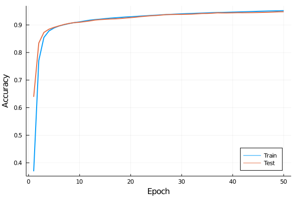

# mercury

This is a native Julia implementation of an shallow (by default three-layer) multilayer perceptron for MNIST digit classification.

The number of layers it can build is extensible, just adjust the `dims` parameter of `main.jl`. 

Backpropagation is implemented in `mercury/backpropagation.jl`. ReLU, Sigmoid, Softmax activation functions are implemented, as well as MSE and cross-entropy loss functions. 

## Training statistics

## References
When developing this code, the following references were invaluable:

[1] https://towardsdatascience.com/lets-code-a-neural-network-in-plain-numpy-ae7e74410795

[2] https://blog.feedly.com/tricks-of-the-trade-logsumexp/

[3] https://deepnotes.io/softmax-crossentropy#cross-entropy-loss