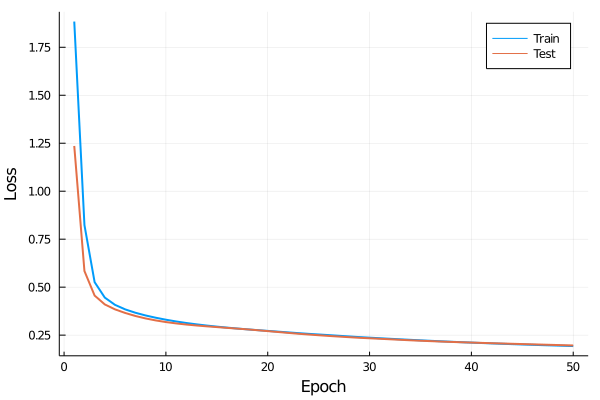

This is a native Julia implementation of an shallow (three-layer) MLP for MNIST digit classification.

The number of layers it can build is extensible, just adjust the `dims` parameter of `main.jl`. 

Backpropagation is implemented in `mercury/backpropagation.jl`. ReLU, Sigmoid, Softmax activation functions are implemented, as well as MSE and cross-entropy loss functions. 

